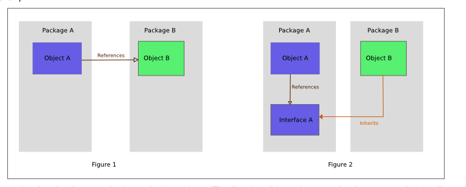
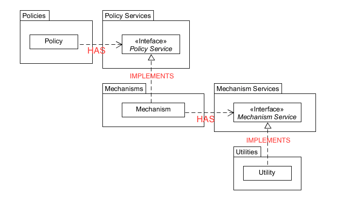

# Notes

To be refactored...

----

## [The Clean Architecture, The Clean Code Blog](https://blog.cleancoder.com/uncle-bob/2012/08/13/the-clean-architecture.html)

- Previous pattters (Hexagon, Onion, etc), use separation of concerns through layers. At least one layer for business rules and another for interfaces

- Characteristics:

  - independent of frameworks
  - testable
  - independent of UI
  - independent of database
  - independent of any external agency

- Dependency Rule

  - inner circles: policies, high level software
  - outer circles: mechanisms, lower level software
  - the rule: source code dependencies can only point inwards
    - inner circles don't know and don't use anything from outter circles
    - data formats of outer circles should not be used in inner circles

- Entities

  - Enterprise wide business rules
  - An object with methods, a set of data structures and functions
  - used by many different applications in the enterprise
  - If you don't have an enterprise
    - entities are the business objects of the application, the high-level rules
    - Note: I wonder if this is how Clean Architecture should be. applied to frontend
  - "No operational change to any particular application should affect the entity layer"

- Use Cases

  - application specific business rules
  - orchestrate the flow of data to and from entities and instruct the entities to use their rules in order to achieve objective of the use case
  - changes in this layer must not affect the entities
  - changes in outer layers should not affect this layer
  - changes in the operation of the application will affect this layer

- Interface Adapters

  - Adapters that convert data from the format convenient for the use cases and entities to the format convenient to the outside

- Frameworks and drivers

  - frameworks and tools
  - write only code to glue 
  - where all the details go (web, database, etc)

- Crossing boundaries

  - Source code dependencies always point inwards
  - Use Dependency Inversion Principle to make the source code dependencies oppose the flow of control. 
  - The flow of control goes from outter circle to inner circles and then back to outter circles, but the dependency is always inward. Use the Dependency Inversion Principle

- What data crosses the boundaries

  - simple data structures, DTO, arguments in function calls, hashmaps, an object
  - it must be isolated, simple, data structures
  - always pass data in the format most convenient to the inner circle

  

## [Dependency Inversion Principle](https://en.wikipedia.org/wiki/Dependency_inversion_principle)

> A. High-level modules should not depend on low-level modules. Both should depend on abstractions (e.g., interfaces).
>
> B. Abstractions should not depend on details. Details (concrete implementations) should depend on abstractions."

It is a way for decoupling software modules.

When we design the interaction between a high-level module and a low-level module, the interaction should be abstract, i.e., we should have an interface that describes the interaction. This is good because we can swap the implementation of the modules and things don't break as long as the contract (interface) is kept. This puts an emphasis on the interaction. Developers have to think and focus on defining the interaction as a first class citizen, which by itself helps to avoid coupling.

The idea is to reduce the mutual dependency (coupling) of high-level and low-level modules. So it's easier to reuse both. The "inversion" idea doesn't mean that the low-level modules depend on the high-level ones. But "both layers should depend on abstractions that draw the behaviour needed by higher-level layers".

In terms of packages and architecture:

- The higher/policy layers define the abstractions.
- The higher/policy components and the abstractions for the lower-level layers are in the same package. The lower-level layers inherit or extend those abstractions when are created.

The DIP can also be seen as an example of the adapter pattern. Patterns that help to wire up the low-level modules and concrete implementations when using DIP: Plugin, Service Locator, Dependency Injection

## Implementations:

### 1. Policies and service abstract classes in one package/library

The low-level components need to import the abstract interfaces from the high-level library to be implemented. This *inverts* the dependency between then. The downside is that it makes it difficult to re-utilize, work and implement the low-level modules.

DIP Implementation 1 1

### 2. Extract policies, abstractions, and low-level modules in their own packages/libraries

DIP Implementation 2 - Modified 2

A high-level policy has an instance of some code that implements the Policy Services. This code is a mechanim. The mechanism has an instance of some code that implements the Mechanism Services. This code is a utility. The benefit is that we can easily swap code since all the dependencies are based on abstractions.

### References

1. https://en.wikipedia.org/wiki/Dependency_inversion_principle#/media/File:Dependency_inversion.png
2. https://en.wikipedia.org/wiki/Dependency_inversion_principle#/media/File:DIPLayersPattern_v2.png

---

https://blog.cleancoder.com/uncle-bob/2012/08/13/the-clean-architecture.html

They all have the same objective, which is the separation of concerns. They all achieve this separation by dividing the software into layers. Each has at least one layer for business rules, and another for interfaces
Independent of Frameworks
Testable.
Independent of UI
Independent of Database
Independent of any external agency
The concentric circles represent different areas of software. In general, the further in you go, the higher level the software becomes. The outer circles are mechanisms. The inner circles are policies.
source code dependencies can only point inwards
Nothing in an inner circle can know anything at all about something in an outer circle.
data formats used in an outer circle should not be used by an inner circle
Entities encapsulate Enterprise wide business rules. An entity can be an object with methods, or it can be a set of data structures and functions. It doesn’t matter so long as the entities could be used by many different applications in the enterprise.
If you don’t have an enterprise, and are just writing a single application, then these entities are the business objects of the application.
application specific business rules
These use cases orchestrate the flow of data to and from the entities, and direct those entities to use their enterprise wide business rules to achieve the goals of the use case.
We do, however, expect that changes to the operation of the application will affect the use-cases and therefore the software in this layer. If the details of a use-case change, then some code in this layer will certainly be affected.
The software in this layer is a set of adapters that convert data from the format most convenient for the use cases and entities, to the format most convenient for some external agency such as the Database or the Web.
The outermost layer is generally composed of frameworks and tools
This layer is where all the details go. The Web is a detail. The database is a detail. We keep these things on the outside where they can do little harm
Note also the source code dependencies. Each one of them points inwards towards the use cases.
We usually resolve this apparent contradiction by using the Dependency Inversion Principle. In a language like Java, for example, we would arrange interfaces and inheritance relationships such that the source code dependencies oppose the flow of control at just the right points across the boundary
The same technique is used to cross all the boundaries in the architectures. We take advantage of dynamic polymorphism to create source code dependencies that oppose the flow of control so that we can conform to The Dependency Rule no matter what direction the flow of control is going in.
Typically the data that crosses the boundaries is simple data structures
The important thing is that isolated, simple, data structures are passed across the boundaries. We don’t want to cheat and pass Entities or Database rows. We don’t want the data structures to have any kind of dependency that violates The Dependency Rule.
So when we pass data across a boundary, it is always in the form that is most convenient for the inner circle.
